# 🎓 UET Chatbot - Hệ Thống RAG Tra Cứu Quy Chế Đào Tạo (VNU-UET)

Dense ChromaDB and persistent Vietnamese BM25 indexing: see
[indexing usage and lifecycle](src/indexing/README.md).

> **UET Chatbot** là trợ lý ảo AI thông minh ứng dụng công nghệ **RAG (Retrieval-Augmented Generation)** nhằm giải đáp tự động các thắc mắc về học vụ, quy chế đào tạo, điều kiện xét tốt nghiệp, thang điểm rèn luyện và học bổng cho sinh viên **Trường Đại học Công nghệ – ĐHQGHN**.

Dự án được thiết kế theo kiến trúc **Modular RAG** chuẩn kỹ nghệ phần mềm: Toàn bộ hệ thống được module hóa độc lập thông qua "bản giao ước" [`base.py`](base.py), giúp **các thành viên trong nhóm có thể code song song cùng lúc mà không lo xung đột (Git conflict)**.

---

## 📌 Mục Lục
1. [Sơ Đồ Kiến Trúc & Cách Hệ Thống Hoạt Động](#1-sơ-đồ-kiến-trúc--cách-hệ-thống-hoạt-động)
2. [Quy Trình Xử Lý Dữ Liệu Đa Chặng & Cơ Chế Chống Trùng Lặp](#2-quy-trình-xử-lý-dữ-liệu-đa-chặng--cơ-chế-chống-trùng-lặp)
3. [Nguyên Tắc Làm Việc Nhóm Song Song (`base.py`)](#3-nguyên-tắc-làm-việc-nhóm-song-song-bản-giao-ước-basepy)
4. [Hướng Dẫn Từng Bước Dành Cho Thành Viên (Developer Guide)](#4-hướng-dẫn-từng-bước-dành-cho-thành-viên-cách-làm)
5. [Bảng Phân Công Nhiệm Vụ Chi Tiết](#5-bảng-phân-công-nhiệm-vụ-chi-tiết)
6. [Cấu Trúc Thư Mục Dự Án](#6-cấu-trúc-thư-mục-dự-án)
7. [Cài Đặt & Các Lệnh Khởi Chạy Hệ Thống (`main.py`)](#7-cài-đặt--các-lệnh-khởi-chạy-hệ-thống-mainpy)

---

## 1. Sơ Đồ Kiến Trúc & Cách Hệ Thống Hoạt Động

<p align="center">
  
</p>

> 📌 **Ghi chú sơ đồ nguyên lý**: Toàn bộ các khối hình trong sơ đồ trên (*tam giác: Input, hình vuông: Middle Data, hình chữ nhật: Process, hình thoi: Pre-trained Model, hình trụ: Vector Database, hình tròn: Response*) được ánh xạ chính xác 1-1 thành các Model dữ liệu và Lớp trừu tượng trong [`base.py`](base.py).

Hệ thống RAG của chúng ta gồm 2 cỗ máy hoạt động độc lập nhưng bổ trợ cho nhau:

```mermaid
flowchart TD
    subgraph OFFLINE ["⚙️ 1. CỖ MÁY OFFLINE: Multi-stage Ingestion & Indexing Pipeline"]
        direction LR
        A["1. Raw Data<br/>(PDF, Web, Docs)"] --> B["2. Cleaner<br/>(Lọc rác, Unicode)"]
        B --> C["3. Processed Data<br/>(Văn bản sạch)"]
        C --> D["4. Chunker<br/>(Cắt đoạn 500-600 ký tự)"]
        D --> E["5. Chunked Data<br/>(JSONL chunks)"]
        E --> F["6. Embedding Model<br/>(all-MiniLM-L6-v2)"]
        F --> G[("7. ChromaDB<br/>(Batching 500/lần)")]
    end

    subgraph ONLINE ["💬 2. CỖ MÁY ONLINE: Hybrid RAG Serving Pipeline"]
        direction LR
        Q["Sinh viên gửi câu hỏi<br/>(Text Query)"] --> BM25["BM25 Lexical Search"]
        Q --> VSearch["Dense Vector Search<br/>(Cosine / ChromaDB)"]
        BM25 --> RRF["Hợp nhất Hybrid (RRF)"]
        VSearch --> RRF
        RRF --> Rerank["Cross-Encoder Reranker<br/>(Top K tối ưu)"]
        Rerank --> Prompt["Ghép Context + Query<br/>vào System Prompt"]
        Prompt --> LLM["Google Gemini LLM<br/>(gemini-3.8-flash)"]
        LLM --> Ans["Câu trả lời thông minh<br/>+ Trích dẫn nguồn (Web / CLI)"]
    end
```



---

## 2. Quy Trình Xử Lý Dữ Liệu Đa Chặng & Cơ Chế Chống Trùng Lặp

Để quản lý kho dữ liệu quy chế học vụ lớn mà không bị nghẽn hoặc xử lý lặp lại nhiều lần, hệ thống phân chia rõ rệt **4 giai đoạn (Stages)** và tích hợp **Sổ cái theo dõi chống trùng lặp (Data Manifest Tracker)**:

### 4 Chặng Dữ Liệu:
1. **`raw`** (`data/raw_data/`): Dữ liệu thô ban đầu (PDF, Word, HTML, văn bản quy chế thu thập được từ cổng thông tin UET).
2. **`processed`** (`data/processed_data/`): Dữ liệu sau khi làm sạch qua [`CleanTextTransformation`](src/ingestion/cleaner.py) (loại bỏ thẻ HTML, ký tự dị biệt, chuẩn hóa khoảng trắng và định dạng UTF-8).
3. **`chunked`** (`data/chunked_data/`): Dữ liệu sau khi được phân tách thành từng đoạn ngắn bởi [`DocumentChunker`](src/chunking/chunker.py) (mỗi đoạn 500-600 ký tự, overlap 100 ký tự để bảo toàn ngữ cảnh).
4. **`vectordb`** (`vector_db/`): Dữ liệu đã được vector hóa qua [`SentenceTransformerEmbedder`](src/embeddings/embedder.py) và lưu trữ bền vững vào ChromaDB với cơ chế nạp theo đợt an toàn (`batch_size = 500`).

### Cơ Chế Chống Trùng Lặp (Deduplication Manifest Tracker):
- Được quản lý bởi lớp [`DataManifestTracker`](src/ingestion/manifest.py) và tệp lưu trữ `data/.ingest_manifest.json`.
- Sử dụng mã băm nội dung **SHA-256** (Content Hash): Khi dữ liệu của một tài liệu hoặc chunk chưa hề thay đổi, hệ thống sẽ **tự động bỏ qua ngay lập tức ($O(1)$)** ở các lần chạy sau, đảm bảo dữ liệu không bị xử lý lặp lại.

---

## 3. Nguyên Tắc Làm Việc Nhóm Song Song: Bản Giao Ước `base.py`

Để cả nhóm làm việc hiệu quả mà không phụ thuộc vào nhau, dự án áp dụng mô hình **Hợp đồng Lập trình (Interface-driven Development)**:

* 📄 **File [`base.py`](base.py) là BẢN GIAO ƯỚC BẤT BIẾN**:
  - Chứa toàn bộ các **Pydantic Data Models**: `RawData`, `ProcessedData`, `DataChunk`, `EmbeddedVector`, `UserQuery`, `RetrievedContext`, `AugmentedPrompt`, `Response`.
  - Chứa các **Lớp trừu tượng (Abstract Base Classes - ABC)** với các hàm bắt buộc phải cài đặt `@abstractmethod`.
* ⚠️ **QUY TẮC SỐNG CÒN**: **TUYỆT ĐỐI KHÔNG SỬA [`base.py`](base.py)**. 
  - Đầu ra của người này chính là đầu vào của người tiếp theo. Miễn là bạn tuân thủ đúng kiểu dữ liệu trong `base.py`, khi ghép code lại cả hệ thống sẽ chạy mượt mà ngay lập tức!
* 💡 **Code mẫu tham khảo**: Mở file [`examples/mock_pipeline_demo.py`](examples/mock_pipeline_demo.py) để xem cách từng class kế thừa và ghép nối từ A đến Z.

---

## 4. Hướng Dẫn Từng Bước Dành Cho Thành Viên (Cách Làm)

Khi bạn được phân công một phần việc, hãy làm theo đúng 5 bước sau:

### 🔹 Bước 1: Xác định nhiệm vụ của mình
Xem [Bảng Phân Công Nhiệm Vụ](#5-bảng-phân-công-nhiệm-vụ-chi-tiết) bên dưới để biết mình phụ trách thư mục nào trong `src/` và cần kế thừa class nào từ [`base.py`](base.py).

### 🔹 Bước 2: Viết code trong thư mục được giao
Ví dụ bạn phụ trách **Chunking**:
1. Mở file [`src/chunking/chunker.py`](src/chunking/chunker.py).
2. Viết class kế thừa từ `BaseChunker`:
   ```python
   from base import BaseChunker, ProcessedData, DataChunk
   from typing import List

   class UETChunker(BaseChunker):
       def chunk(self, doc: ProcessedData) -> List[DataChunk]:
           # Viết thuật toán cắt đoạn văn bản ở đây...
           pass
   ```

### 🔹 Bước 3: Chạy kiểm thử riêng module của mình (Unit Test)
Ở cuối file bạn đang viết, viết khối `if __name__ == "__main__":` để chạy thử xem dữ liệu ra có đúng chuẩn không:
```bash
python src/chunking/chunker.py
```

### 🔹 Bước 4: Ghép vào cỗ máy tổng thể tại `src/pipeline.py`
Mở file [`src/pipeline.py`](src/pipeline.py) (trái tim điều phối của dự án), thay thế class tạm bằng class thật mà bạn vừa viết:
```python
from src.chunking.chunker import UETChunker
```

### 🔹 Bước 5: Chạy kiểm tra End-to-End toàn hệ thống
- **Kiểm thử dòng lệnh**:
  ```bash
  python src/pipeline.py
  ```
- **Chạy toàn bộ bài kiểm thử tự động**:
  ```bash
  python -m unittest discover tests
  ```

---

## 5. Bảng Phân Công Nhiệm Vụ Chi Tiết

| Tasks | Thư mục & File cần code | Lớp kế thừa từ [`base.py`](base.py) | Đầu vào $\rightarrow$ Đầu ra | Nhiệm vụ cụ thể |
| :--- | :--- | :--- | :--- | :--- |
| **Task 1** | `src/ingestion/loader.py`, `cleaner.py`, `manifest.py` | `BaseDataCrawler`, `BaseTransformation` | `DataSource` $\rightarrow$ `RawData` $\rightarrow$ `ProcessedData` | Đọc tệp, làm sạch dữ liệu, quản lý sổ cái chống trùng lặp SHA-256. |
| **Task 2** | `src/chunking/chunker.py` | `BaseChunker` | `ProcessedData` $\rightarrow$ `List[DataChunk]` | Cắt văn bản thành từng đoạn 500-600 ký tự kèm overlap 100 ký tự. |
| **Task 3** | `src/embeddings/embedder.py` | `BaseEmbeddingModel` | `List[str]` $\rightarrow$ `List[List[float]]` | Chuyển văn bản thành vector số (mô hình 384 chiều `all-MiniLM-L6-v2` hoặc Gemini). |
| **Task 4** | `src/vectordb/vector_store.py` | `BaseVectorStore` | `DataChunk` + `Vector` $\rightarrow$ Lưu DB | Quản lý ChromaDB, tìm kiếm tương đồng và nạp dữ liệu an toàn theo lô (`batch_size=500`). |
| **Task 5** | `src/retrieval/retriever.py` | `BaseRetriever` | `UserQuery` $\rightarrow$ `List[RetrievedContext]` | Truy xuất lai (BM25 + Dense Vector), RRF Ranking và Reranker chọn top k. |
| **Task 6** | `src/prompts/prompt_templates.py` | `BasePromptAugmenter` | `UserQuery` + `Contexts` $\rightarrow$ `AugmentedPrompt` | Thiết kế lời nhắc chuyên viên đào tạo UET, ghép ngữ cảnh và câu hỏi vào mẫu chuẩn. |
| **Task 7** | `src/llm/llm_client.py` | `BaseLLM` | `AugmentedPrompt` $\rightarrow$ `Response` | Tích hợp Google Gemini (`gemini-3.8-flash`) để đọc ngữ cảnh và sinh câu trả lời. |
| **Task 8** | `src/evaluation/evaluator.py` | `BaseEvaluator` | Pipeline + Dataset $\rightarrow$ `EvaluationReport` | Đánh giá độ tin cậy (*Faithfulness, Relevance*) trên tập test chuẩn `test_qa_dataset.json`. |
| **Task 9 / Lead** | `src/interfaces/routes.py` & `src/pipeline.py` | FastAPI & Pipeline | Web / REST API | Ghép nối các module, điều phối Multi-stage Ingestion, duy trì Web UI và CLI. |

---

## 6. Cấu Trúc Thư Mục Dự Án

```text
UET_chatbot/
├── README.md                 # 📖 Tài liệu hướng dẫn toàn diện này
├── base.py                   # ⚠️ BẢN GIAO ƯỚC CHUNG (Data Models & Abstract Classes)
├── main.py                   # 🚀 ĐIỂM KHỞI CHẠY CHÍNH (Hỗ trợ Web, CLI, Eval, Ingest)
├── config.yaml               # ⚙️ File cấu hình chung (Model, chunk_size, top_k...)
├── requirements.txt          # 📦 Danh sách thư viện Python cần cài đặt
├── .env                      # 🔑 Chứa GEMINI_API_KEY (Không commit lên Git)
├── .env.example              # 📝 File mẫu hướng dẫn tạo .env
├── .gitignore                # 🛡️ Danh sách file bỏ qua trên Git
│
├── vector_db/                # 🗄️ Thư mục ChromaDB cục bộ (Chứa vector kho dữ liệu UET)
│   └── chroma.sqlite3
│
├── src/                      # 💻 MÃ NGUỒN CÁC MODULE CHÍNH
│   ├── pipeline.py           # ⚙️ Trái tim điều phối Ingestion đa chặng & RAG Serving
│   ├── ingestion/            # Module 1: Cào, làm sạch và sổ cái manifest dữ liệu
│   │   ├── loader.py         # Đọc tệp thô (PDF, Word, TXT, HTML)
│   │   ├── cleaner.py        # Làm sạch và chuẩn hóa văn bản
│   │   └── manifest.py       # Sổ cái chống xử lý trùng lặp bằng SHA-256
│   ├── chunking/             # Module 2: Cắt nhỏ văn bản (500-600 ký tự)
│   ├── embeddings/           # Module 3: Vector hóa văn bản (Sentence-Transformers)
│   ├── vectordb/             # Module 4: Quản lý ChromaDB & batch upsert
│   ├── retrieval/            # Module 5: Hybrid Retrieval (BM25 + Dense + Reranker)
│   ├── prompts/              # Module 6: Quản lý mẫu Prompt chuyên gia UET
│   ├── llm/                  # Module 7: Tích hợp Google Gemini SDK
│   ├── evaluation/           # Module 8: Đánh giá chất lượng RAG Triad & HitRate/MRR
│   ├── interfaces/           # Module 9: Tầng giao diện người dùng
│   │   ├── routes.py         # REST API endpoints (/api/chat, /api/health)
│   │   ├── cli.py            # Giao diện dòng lệnh Terminal tương tác trực tiếp
│   │   └── static/           # Giao diện Web HTML/CSS/JS hiện đại
│   └── utils/                # Module 10: Tiện ích logger, đo thời gian, đọc config
│
├── data/                     # 📂 Dữ liệu học vụ UET qua các giai đoạn
│   ├── .ingest_manifest.json # Sổ cái cache chống xử lý lặp lại
│   ├── raw_data/             # 1. Dữ liệu thô gốc (PDF, Word, HTML)
│   ├── processed_data/       # 2. Dữ liệu văn bản đã làm sạch
│   ├── chunked_data/         # 3. Dữ liệu đã chia thành các chunk JSONL
│   └── eval_data/            # 4. Bộ câu hỏi Benchmark QA (test_qa_dataset.json)
│
├── examples/                 # 📚 Code mẫu tham khảo luồng kế thừa
│   └── mock_pipeline_demo.py
└── tests/                    # 🧪 Kiểm thử tự động
    ├── test_app.py
    └── test_ingestion_stages.py
```

---

## 7. Cài Đặt & Các Lệnh Khởi Chạy Hệ Thống (`main.py`)

### 1. Cài đặt môi trường ban đầu
```bash
# 1. Tạo môi trường ảo Python
python -m venv .venv

# 2. Kích hoạt môi trường (Windows PowerShell)
.venv\Scripts\Activate.ps1

# 3. Cài đặt các thư viện cần thiết
pip install -r requirements.txt

# 4. Tạo file cấu hình .env từ file mẫu
cp .env.example .env
```
👉 Mở file `.env` và điền `GEMINI_API_KEY` của bạn (Lấy miễn phí tại [Google AI Studio](https://aistudio.google.com/app/apikey)).

---

### 2. Các Lệnh Điều Phối Dữ Liệu (Multi-stage Data Ingestion)

#### 📊 Xem báo cáo thống kê dữ liệu 4 chặng & Sổ cái manifest
```bash
python main.py --ingest-status
```
Lệnh này sẽ in ra số lượng file tại `raw`, số văn bản tại `processed`, số chunks tại `chunked`, số vectors trong `vector_db` cùng tiến độ của sổ cái chống trùng lặp.

#### ⚙️ Chạy nạp dữ liệu từ chặng xuất phát đến chặng đích
Hệ thống hỗ trợ 4 mốc: `raw` $\rightarrow$ `processed` $\rightarrow$ `chunked` $\rightarrow$ `vectordb`.

- **Từ dữ liệu thô `raw` sang dữ liệu sạch `processed`**:
  ```bash
  python main.py --ingest --from raw --to processed
  ```

- **Từ dữ liệu thô `raw` sang `chunked`** (tự động trải qua bước làm sạch trung gian):
  ```bash
  python main.py --ingest --from raw --to chunked
  ```

- **Từ dữ liệu sạch `processed` nạp thẳng vào `vectordb`** (tự động đi qua bước chunking):
  ```bash
  python main.py --ingest --from processed --to vectordb
  ```

- **Chạy toàn bộ quy trình từ đầu đến cuối (`raw` $\rightarrow$ `vectordb`)**:
  ```bash
  python main.py --ingest --from raw --to vectordb
  ```

---

### 3. Các Lệnh Trải Nghiệm & Đánh Giá Chatbot

#### 🌟 1. Khởi chạy Giao diện Web (Khuyên Dùng)
```bash
python main.py --web
```
- Mở trình duyệt tại `http://127.0.0.1:8000`.
- Giao diện chat hiện đại, hỗ trợ gợi ý câu hỏi, popup xem trích dẫn tài liệu quy chế UET.
- Xem tài liệu Swagger REST API tại: `http://127.0.0.1:8000/docs`.

#### 💻 2. Khởi chạy Chatbot trên Terminal (CLI Mode)
```bash
python main.py --cli
```
- Tương tác hỏi đáp tức thì ngay trên cửa sổ dòng lệnh.
- Các lệnh hữu ích khi chat: `stats` (thống kê vector), `clear` (xóa màn hình), `exit` (thoát).

#### 📊 3. Chấm điểm chất lượng RAG (Benchmark QA Evaluation)
```bash
python main.py --eval
```
- Tính toán điểm **RAG Triad** (*Faithfulness, Answer Relevance, Context Relevance*) trên tập benchmark `test_qa_dataset.json`.
- Xuất báo cáo kết quả chi tiết phục vụ báo cáo và slide thuyết trình.

---

> 💡 **Dành cho lập trình viên:**
> - Kiểm tra toàn bộ Unit Test: `python -m unittest discover tests`
> - Kiểm tra riêng các giai đoạn Ingestion: `python -m unittest tests/test_ingestion_stages.py`
> - Đọc code mẫu ghép nối các lớp: `python examples/mock_pipeline_demo.py`
