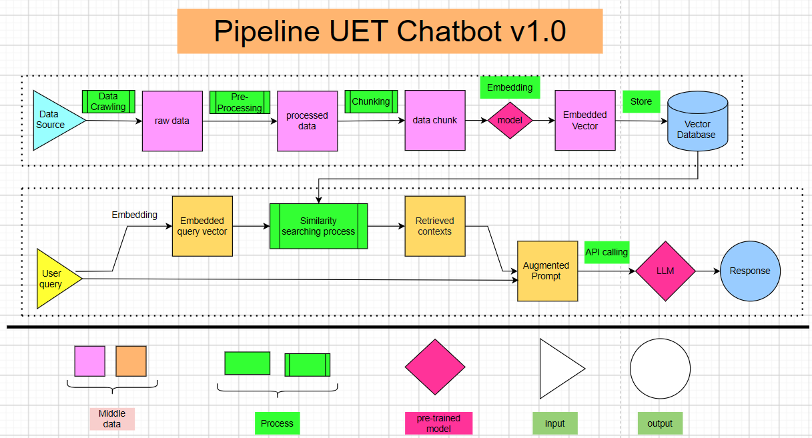

# 🎓 UET Chatbot - Hệ Thống RAG Tra Cứu Quy Chế Đào Tạo (VNU-UET)

> **UET Chatbot** là trợ lý ảo AI thông minh ứng dụng công nghệ **RAG (Retrieval-Augmented Generation)** nhằm giải đáp tự động các thắc mắc về học vụ, quy chế đào tạo, điều kiện xét tốt nghiệp, thang điểm rèn luyện và học bổng cho sinh viên **Trường Đại học Công nghệ – ĐHQGHN**.

Dự án được thiết kế theo kiến trúc **Modular RAG** chuẩn kỹ nghệ phần mềm: Toàn bộ hệ thống được module hóa độc lập thông qua "bản giao ước" [`base.py`](base.py), giúp **8–9 thành viên trong nhóm có thể code song song cùng lúc mà không lo xung đột (Git conflict)**.

---

## 📌 Mục Lục
1. [Sơ Đồ Kiến Trúc & Cách Hệ Thống Hoạt Động](#1-sơ-đồ-kiến-trúc--cách-hệ-thống-hoạt-động)
2. [Nguyên Tắc Làm Việc Nhóm Song Song](#2-nguyên-tắc-làm-việc-nhóm-song-song-bản-giao-ước-basepy)
3. [Hướng Dẫn Từng Bước Dành Cho Thành Viên (Developer Guide)](#3-hướng-dẫn-từng-bước-dành-cho-thành-viên-cách-làm)
4. [Bảng Phân Công Nhiệm Vụ Chi Tiết](#4-bảng-phân-công-nhiệm-vụ-chi-tiết)
5. [Cấu Trúc Thư Mục Dự Án](#5-cấu-trúc-thư-mục-dự-án)
6. [Cài Đặt & 3 Lệnh Khởi Chạy](#6-cài-đặt--3-lệnh-khởi-chạy-chính)

---

## 1. Sơ Đồ Kiến Trúc & Cách Hệ Thống Hoạt Động

<p align="center">
  
</p>

> 📌 **Ghi chú sơ đồ nguyên lý**: Toàn bộ các khối hình trong sơ đồ trên (*tam giác: Input, hình vuông: Middle Data, hình chữ nhật: Process, hình thoi: Pre-trained Model, hình trụ: Vector Database, hình tròn: Response*) được ánh xạ chính xác 1-1 thành các Model dữ liệu và Lớp trừu tượng trong [`base.py`](base.py).

Hệ thống RAG của chúng ta gồm 2 cỗ máy hoạt động độc lập nhưng bổ trợ cho nhau:

```mermaid
flowchart TD
    subgraph OFFLINE ["⚙️ 1. CỖ MÁY OFFLINE: Ingestion & Indexing Pipeline (Nạp dữ liệu)"]
        direction LR
        A["1. Tài liệu UET<br/>(PDF, Web, Word)"] --> B["2. Data Crawler<br/>(Bóc tách text thô)"]
        B --> C["3. Preprocessor<br/>(Làm sạch HTML/kí tự rác)"]
        C --> D["4. Chunker<br/>(Cắt thành đoạn 600 từ)"]
        D --> E["5. Embedding Model<br/>(all-MiniLM-L6-v2)"]
        E --> F[("6. ChromaDB<br/>(vector_db/)<br/>452+ vectors")]
    end

    subgraph ONLINE ["💬 2. CỖ MÁY ONLINE: RAG Serving Pipeline (Hỏi đáp thời gian thực)"]
        direction LR
        Q["Sinh viên gõ câu hỏi<br/>(Text)"] --> QV["Vector hóa câu hỏi<br/>(Query Vector)"]
        QV --> Search["Tìm kiếm tương đồng Cosine<br/>trong vector_db/"]
        Search --> TopK["Rút ra 3-5 đoạn Text<br/>liên quan nhất"]
        TopK --> Prompt["Ghép Context + Câu hỏi<br/>vào System Prompt"]
        Prompt --> Gemini["Google Gemini LLM<br/>(gemini-3.8-flash)"]
        Gemini --> Ans["Câu trả lời thông minh<br/>+ Trích dẫn nguồn (Web / CLI)"]
    end
```



---

## 2. Nguyên Tắc Làm Việc Nhóm Song Song: Bản Giao Ước `base.py`

Để cả nhóm làm việc hiệu quả mà không phụ thuộc vào nhau, dự án áp dụng mô hình **Hợp đồng Lập trình (Interface-driven Development)**:

* 📄 **File [`base.py`](base.py) là BẢN GIAO ƯỚC BẤT BIẾN**:
  - Chứa toàn bộ các **Pydantic Data Models**: `RawData`, `ProcessedData`, `DataChunk`, `EmbeddedVector`, `UserQuery`, `RetrievedContext`, `AugmentedPrompt`, `Response`.
  - Chứa các **Lớp trừu tượng (Abstract Base Classes - ABC)** với các hàm bắt buộc phải cài đặt `@abstractmethod`.
* ⚠️ **QUY TẮC SỐNG CÒN**: **TUYỆT ĐỐI KHÔNG SỬA [`base.py`](base.py)**. 
  - Đầu ra của người này chính là đầu vào của người tiếp theo. Miễn là bạn tuân thủ đúng kiểu dữ liệu trong `base.py`, khi ghép code lại cả hệ thống sẽ chạy mượt mà ngay lập tức!
* 💡 **Code mẫu tham khảo**: Mở file [`examples/mock_pipeline_demo.py`](examples/mock_pipeline_demo.py) để xem cách từng class kế thừa và ghép nối từ A đến Z.

---

## 3. Hướng Dẫn Từng Bước Dành Cho Thành Viên (Cách Làm)

Khi bạn được phân công một phần việc, hãy làm theo đúng 5 bước sau:

### 🔹 Bước 1: Xác định nhiệm vụ của mình
Xem [Bảng Phân Công Nhiệm Vụ](#4-bảng-phân-công-nhiệm-vụ-chi-tiết) bên dưới để biết mình phụ trách thư mục nào trong `src/` và cần kế thừa class nào từ [`base.py`](base.py).

### 🔹 Bước 2: Viết code trong thư mục được giao
Ví dụ bạn phụ trách **Chunking**:
1. Mở file [`src/chunking/chunker.py`](src/chunking/chunker.py).
2. Viết class kế thừa từ `BaseChunker`:
   ```python
   from base import BaseChunker, ProcessedData, DataChunk
   from typing import List

   class UETChunker(BaseChunker):
       def chunk(self, doc: ProcessedData) -> List[DataChunk]:
           # Viết thuật toán cắt đoạn văn bản ở đây...
           pass
   ```

### 🔹 Bước 3: Chạy kiểm thử riêng module của mình (Unit Test)
Ở cuối file bạn đang viết, viết khối `if __name__ == "__main__":` để chạy thử xem dữ liệu ra có đúng chuẩn không:
```bash
python src/chunking/chunker.py
```

### 🔹 Bước 4: Ghép vào cỗ máy tổng thể tại `src/pipeline.py`
Mở file [`src/pipeline.py`](src/pipeline.py) (trái tim điều phối của dự án), thay thế class tạm bằng class thật mà bạn vừa viết:
```python
# Thay vì dùng class mock, import class thật bạn vừa làm xong:
from src.chunking.chunker import UETChunker
```

### 🔹 Bước 5: Chạy kiểm tra End-to-End toàn hệ thống
- **Dành cho lập trình viên**: Gõ lệnh sau để kiểm tra luồng chạy từ đầu đến cuối trên console:
  ```bash
  python src/pipeline.py
  ```
- **Dành cho trải nghiệm người dùng**: Khởi chạy Chatbot để hỏi đáp thử:
  ```bash
  python main.py --cli    # Chat trên terminal
  # hoặc
  python main.py --web    # Chat trên giao diện web
  ```

---

## 4. Bảng Phân Công Nhiệm Vụ Chi Tiết

| Thành viên | Thư mục & File cần code | Lớp kế thừa từ [`base.py`](base.py) | Đầu vào $\rightarrow$ Đầu ra | Nhiệm vụ cụ thể |
| :--- | :--- | :--- | :--- | :--- |
| **Thành viên 1** | `src/ingestion/loader.py` | `BaseDataCrawler` | `DataSource` $\rightarrow$ `List[RawData]` | Đọc file PDF/Word từ `data/raw_data/` hoặc cào bài viết trên web UET. |
| **Thành viên 2** | `src/chunking/chunker.py` | `BaseChunker` | `ProcessedData` $\rightarrow$ `List[DataChunk]` | Cắt văn bản thành từng đoạn 500-600 ký tự kèm overlap 100 ký tự. |
| **Thành viên 3** | `src/embeddings/embedder.py` | `BaseEmbeddingModel` | `List[str]` $\rightarrow$ `List[List[float]]` | Chuyển văn bản thành vector số (dùng mô hình 384 chiều `all-MiniLM-L6-v2` hoặc Gemini). |
| **Thành viên 4** | `src/vectordb/vector_store.py` | `BaseVectorStore` | `DataChunk` + `Vector` $\rightarrow$ Lưu DB | Lưu trữ vector và thực hiện tìm kiếm tương đồng trên **ChromaDB**. |
| **Thành viên 5** | `src/retrieval/retriever.py` | Điều phối tìm kiếm | `UserQuery` $\rightarrow$ `List[RetrievedContext]` | Nhận câu hỏi, gọi embedder và vector_store để lấy ra top 3-5 đoạn liên quan nhất. |
| **Thành viên 6** | `src/prompts/prompt_templates.py` | `BasePromptAugmenter` | `UserQuery` + `Contexts` $\rightarrow$ `AugmentedPrompt` | Thiết kế lời nhắc chuyên viên đào tạo UET, ghép ngữ cảnh và câu hỏi vào mẫu chuẩn. |
| **Thành viên 7** | `src/llm/llm_client.py` | `BaseLLM` | `AugmentedPrompt` $\rightarrow$ `Response` | Gọi Google GenAI SDK (`gemini-3.8-flash`) để đọc ngữ cảnh và viết câu trả lời. |
| **Thành viên 8** | `src/evaluation/evaluator.py` | `BaseEvaluator` | Pipeline + Dataset $\rightarrow$ `EvaluationReport` | Đánh giá độ tin cậy (*Faithfulness, Relevance*) trên tập test chuẩn `test_qa_dataset.json`. |
| **Thành viên 9 / Lead** | `src/interfaces/routes.py` & `src/pipeline.py` | FastAPI & Pipeline | Web / REST API | Ghép nối các module, duy trì Web UI, CLI và điều phối dự án. |

---

## 5. Cấu Trúc Thư Mục Dự Án

```text
UET_chatbot/
├── README.md                 # 📖 Tài liệu hướng dẫn toàn diện này
├── base.py                   # ⚠️ BẢN GIAO ƯỚC CHUNG (Data Models & Abstract Classes)
├── main.py                   # 🚀 ĐIỂM KHỞI CHẠY CHÍNH (Chứa đúng 3 lệnh: --web, --cli, --eval)
├── config.yaml               # ⚙️ File cấu hình chung (Model, chunk_size, top_k...)
├── requirements.txt          # 📦 Danh sách thư viện Python cần cài đặt
├── .env                      # 🔑 Chứa GEMINI_API_KEY (Không commit lên Git)
├── .env.example              # 📝 File mẫu hướng dẫn tạo .env
├── .gitignore                # 🛡️ Danh sách file bỏ qua trên Git (Bảo mật & nhẹ repo)
│
├── vector_db/                # 🗄️ Thư mục ChromaDB cục bộ (Đã chứa sẵn 452+ vectors tài liệu UET)
│   └── chroma.sqlite3
│
├── src/                      # 💻 MÃ NGUỒN CÁC MODULE CHÍNH (Nơi thành viên làm việc)
│   ├── pipeline.py           # ⚙️ Trái tim điều phối toàn bộ luồng Ingestion & RAG
│   ├── ingestion/            # Module 1: Cào & đọc tài liệu
│   ├── chunking/             # Module 2: Cắt nhỏ văn bản
│   ├── embeddings/           # Module 3: Vector hóa văn bản
│   ├── vectordb/             # Module 4: Quản lý ChromaDB
│   ├── retrieval/            # Module 5: Truy xuất ngữ cảnh
│   ├── prompts/              # Module 6: Quản lý mẫu Prompt
│   ├── llm/                  # Module 7: Tích hợp Google Gemini
│   ├── evaluation/           # Module 8: Đánh giá chất lượng RAG Triad
│   ├── interfaces/           # Module 9: Tầng giao diện người dùng (Web UI & CLI)
│   │   ├── routes.py         # REST API endpoints & Web server (/api/chat)
│   │   ├── cli.py            # Giao diện dòng lệnh Terminal (CLI Mode)
│   │   └── static/           # Giao diện web người dùng (HTML/CSS/JS)
│   └── utils/                # Module 10: Tiện ích logger, đo thời gian, đọc config
│
├── data/                     # 📂 Dữ liệu học vụ UET
│   ├── doc.md                # 📌 Hướng dẫn chuẩn bị dữ liệu nội bộ
│   ├── raw_data/             # Chứa file PDF, Word gốc (được gitignore để nhẹ repo)
│   ├── processed_data/       # Chứa text sạch sau tiền xử lý
│   └── eval_data/            # Bộ dữ liệu Benchmark QA (test_qa_dataset.json)
│
├── examples/                 # 📚 Code mẫu tham khảo
│   └── mock_pipeline_demo.py # Kịch bản chạy mẫu minh họa đầy đủ các bước
└── tests/                    # 🧪 Kiểm thử tự động (Chạy bằng lệnh: pytest)
    └── test_app.py
```

---

## 6. Cài Đặt & 3 Lệnh Khởi Chạy Chính

### 1. Cài đặt môi trường ban đầu
```bash
# 1. Tạo môi trường ảo Python
python -m venv .venv

# 2. Kích hoạt môi trường (Windows PowerShell)
.venv\Scripts\Activate.ps1

# 3. Cài đặt các thư viện cần thiết
pip install -r requirements.txt

# 4. Tạo file cấu hình .env từ file mẫu
cp .env.example .env
```
👉 Mở file `.env` và điền `GEMINI_API_KEY` của bạn (Lấy miễn phí tại [Google AI Studio](https://aistudio.google.com/app/apikey)).

---

### 2. Đúng 3 Lệnh Sử Dụng Cốt Lõi (`main.py`)

Hệ thống đã được tinh gọn tối đa, phục vụ trọn vẹn 3 nhu cầu sử dụng:

#### 🌟 1. Khởi chạy Giao diện Web (Khuyên Dùng)
```bash
python main.py --web
```
- Tự động mở trình duyệt tại `http://127.0.0.1:8000`.
- Giao diện chat hiện đại, hỗ trợ gợi ý câu hỏi nhanh, popup xem nguồn trích dẫn tài liệu UET.
- Tài liệu REST API tự động tại: `http://127.0.0.1:8000/docs`.

#### 💻 2. Khởi chạy Chatbot trên Terminal (CLI Mode)
```bash
python main.py --cli
```
- Dành cho lúc cần hỏi đáp nhanh ngay trên cửa sổ dòng lệnh.
- Các lệnh gõ trực tiếp trong khi chat: `stats` (xem thống kê vector), `clear` (xóa màn hình), `exit` (thoát).

#### 📊 3. Chấm điểm chất lượng RAG (Benchmark Evaluation)
```bash
python main.py --eval
```
- Tự động tính toán điểm số **RAG Triad** (*Faithfulness, Answer Relevance, Context Relevance*) trên tập câu hỏi kiểm chuẩn `test_qa_dataset.json`.
- Xuất báo cáo điểm số để đưa vào slide thuyết trình và báo cáo đồ án.

---

> 💡 **Dành cho lập trình viên:**
> - Chạy bộ kiểm thử tính toàn vẹn: `pytest`
> - Chạy kiểm thử End-to-End nhanh trong code: `python src/pipeline.py`
> - Đọc code mẫu ghép nối: `python examples/mock_pipeline_demo.py`