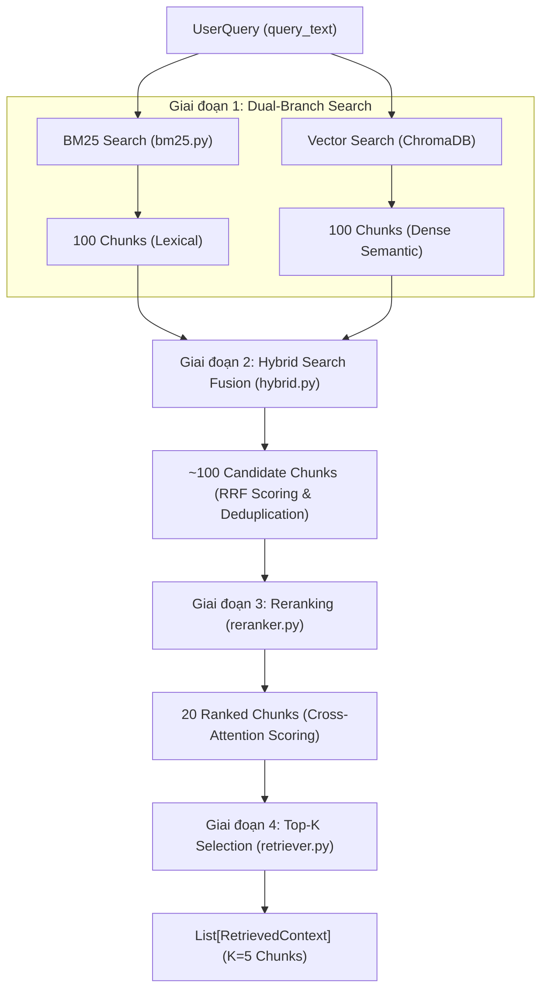

# Tài Liệu Kỹ Thuật Phân Hệ Retrieval (Truy Xuất Ngữ Cảnh)

Tài liệu này mô tả chi tiết kiến trúc, thuật toán, công thức toán học và luồng xử lý dữ liệu của phân hệ **Retrieval** (Task 5) trong dự án UET Chatbot.

---

## 1. Kiến Trúc Luồng Dữ Liệu (Pipeline Architecture)

Phân hệ tiếp nhận câu hỏi của người dùng (`UserQuery`) và trả về danh sách $K$ đoạn văn bản liên quan nhất (`List[RetrievedContext]`) thông qua 4 giai đoạn xử lý nối tiếp:



### Bảng biến thiên số lượng dữ liệu qua từng giai đoạn:
| Giai đoạn | Tên xử lý | Dữ liệu đầu vào | Dữ liệu đầu ra |
| :--- | :--- | :--- | :--- |
| **Giai đoạn 1** | Dual-Branch Search | 1 `UserQuery` | 100 BM25 chunks + 100 Vector chunks |
| **Giai đoạn 2** | Hybrid Fusion (RRF) | 200 chunks (từ 2 nhánh) | ~100 Candidate chunks (đã khử trùng lặp) |
| **Giai đoạn 3** | Reranker | ~100 Candidate chunks | 20 Ranked chunks |
| **Giai đoạn 4** | Top-K Selection | 20 Ranked chunks | $K$ Chunks (mặc định $K = 5$) |

---

## 2. Chi Tiết Các Giai Đoạn Xử Lý

### 2.1. Giai đoạn 1: Dual-Branch Search (Tìm kiếm song song)

Hệ thống triển khai 2 nhánh tìm kiếm song song để tận dụng ưu điểm của cả hai phương pháp trích xuất:

#### Nhánh A: BM25 Search (`src/retrieval/bm25.py`)
- **Mục tiêu:** Bắt chính xác các từ khóa học vụ, mã học phần (ví dụ: `INT1008`), số quyết định (`4616/QĐ-ĐHQGHN`), và thuật ngữ chuyên ngành.
- **Tiền xử lý & Tokenization:**
  - Chuyển văn bản thành chữ thường, loại bỏ ký tự đặc biệt, bảo toàn chữ cái tiếng Việt và số hiệu qua regex `[\w\-]+`.
  - Sinh **Unigram** (từ đơn) và **Bigram** (từ ghép 2 âm tiết liên tiếp: `học_bổng`, `tốt_nghiệp`, `rèn_luyện`) nhằm tối ưu độ phủ ngữ nghĩa tiếng Việt.
- **Thuật toán sử dụng:** **BM25+** (Best Matching 25 Plus). Khắc phục nhược điểm của BM25 thông thường đối với văn bản quy chế dài bằng tham số $\delta$:
  $$\text{IDF}(q) = \ln \left( \frac{N - n(q) + 0.5}{n(q) + 0.5} + 1 \right)$$
  $$\text{Score}_{BM25+}(D, Q) = \sum_{q \in Q} \left[ \text{IDF}(q) \cdot \left( \frac{f(q, D) \cdot (k_1 + 1)}{f(q, D) + k_1 \cdot \left( 1 - b + b \cdot \frac{\|D\|}{\text{avgdl}} \right)} + \delta \right) \right]$$
  - Tham số mặc định: $k_1 = 1.5$ (độ bão hòa tần suất từ), $b = 0.75$ (chuẩn hóa độ dài văn bản), $\delta = 1.0$.
- **Cơ chế nạp dữ liệu:** Tự động đồng bộ toàn bộ documents và metadatas từ `vector_store` (hoặc ChromaDB) khi khởi tạo.
- **Đầu ra:** Top 100 `RetrievedContext` sắp xếp theo điểm BM25 giảm dần.

#### Nhánh B: Vector Search (`ChromaDB`)
- **Mục tiêu:** Nắm bắt tương quan ngữ nghĩa câu hỏi ngay cả khi người dùng sử dụng từ đồng nghĩa hoặc cách diễn đạt khác văn bản gốc.
- **Quy trình:**
  1. Nhúng câu hỏi thành vector đặc trưng: `query_vector = embedding_model.embed_query(query)`.
  2. Truy vấn không gian vector ChromaDB bằng khoảng cách Cosine:
     $$\text{CosineSimilarity}(\vec{u}, \vec{v}) = \frac{\vec{u} \cdot \vec{v}}{\|\vec{u}\| \|\vec{v}\|}$$
- **Đầu ra:** Top 100 `RetrievedContext` sắp xếp theo điểm Cosine Similarity giảm dần.

---

### 2.2. Giai đoạn 2: Hybrid Search Fusion (`src/retrieval/hybrid.py`)

Hợp nhất hai tập kết quả (100 BM25 + 100 Vector) bằng thuật toán **Reciprocal Rank Fusion (RRF)**:

- **Công thức tính điểm RRF:**
  $$RRF(d) = \frac{w_{bm25}}{k + rank_{bm25}(d)} + \frac{w_{vec}}{k + rank_{vec}(d)}$$
  - $rank_{bm25}(d)$: Thứ hạng của chunk $d$ trong danh sách BM25 ($1 \dots 100$).
  - $rank_{vec}(d)$: Thứ hạng của chunk $d$ trong danh sách Vector ($1 \dots 100$).
  - $k = 60$: Hằng số làm mượt tiêu chuẩn (smoothing parameter).
  - $w_{vec} = 0.6$: Trọng số nhánh Vector Search.
  - $w_{bm25} = 0.4$: Trọng số nhánh BM25 Search.

- **Khử trùng lặp (`chunk_id` Deduplication):**
  - Nếu chunk $d$ xuất hiện ở cả hai danh sách, điểm RRF từ hai nhánh được cộng dồn.
  - Metadata được tổng hợp đầy đủ từ cả hai nguồn (bao gồm `bm25_rank`, `vector_rank`, `bm25_score`, `vector_score`).
- **Chuẩn hóa điểm số:** Điểm RRF được chuẩn hóa về đoạn $[0.01, 1.0]$ theo chunk có điểm cao nhất.
- **Đầu ra:** Top ~100 candidate chunks có điểm RRF cao nhất.

---

### 2.3. Giai đoạn 3: Reranking (`src/retrieval/reranker.py`)

Thực hiện đánh giá tương quan ngữ nghĩa sâu trực tiếp giữa cặp $(Query, Passage)$ cho ~100 candidate chunks để chọn lọc xuống 20 ranked chunks:

#### Cơ chế đa Backend (`RerankerFactory`):
1. **`FlashRankReranker`:**
   - Dựa trên mô hình Cross-Encoder nén chạy qua **ONNX Runtime** (mô hình `ms-marco-MiniLM-L-12-v2`).
   - Tốc độ xử lý: 10–20ms trên CPU, không yêu cầu GPU.
2. **`CrossEncoderReranker`:**
   - Sử dụng thư viện `sentence-transformers` với các mô hình sâu (ví dụ: `BAAI/bge-reranker-v2-m3`).
3. **`HeuristicReranker` (Thuật toán dự phòng mặc định - Zero External Dependencies):**
   - Hoạt động thuần túy bằng thuật toán nội bộ, đảm bảo hệ thống không phát sinh lỗi trong mọi môi trường kiểm thử.
   - Điểm đánh giá kết hợp 4 tiêu chí:
     $$\text{Score}_{rerank} = 0.45 \cdot S_{base} + 0.30 \cdot C_{query} + 0.15 \cdot P_{phrase} + 0.10 \cdot W_{pos}$$
     - $S_{base}$: Điểm tương đồng nền tảng từ giai đoạn Hybrid RRF.
     - $C_{query}$: Tỷ lệ từ khóa của câu hỏi xuất hiện trong đoạn văn và tiêu đề (Query Coverage Ratio).
     - $P_{phrase}$: Điểm thưởng khi phát hiện cụm từ chính xác ($0.25$ nếu xuất hiện, $0$ nếu không).
     - $W_{pos}$: Trọng số xuất hiện sớm (từ khóa nằm trong tiêu đề hoặc 200 ký tự đầu tiên).

- **Đầu ra:** Top 20 ranked chunks sắp xếp theo điểm rerank giảm dần.

---

### 2.4. Giai đoạn 4: Top-K Selection (`src/retrieval/retriever.py`)

Từ 20 ranked chunks của Giai đoạn 3, hệ thống hoàn tất quy trình:
1. **Lọc ngưỡng (`score_threshold`):** Loại bỏ các chunk có điểm thấp hơn ngưỡng quy định (nếu được cấu hình). Nếu tất cả các chunk đều dưới ngưỡng, giữ lại tối thiểu 1 chunk tốt nhất để bảo toàn ngữ cảnh.
2. **Cắt Top-K:** Lấy đúng $K$ đoạn đầu tiên (mặc định $K = 5$).
3. **Chuẩn hóa đối tượng đầu ra:**
   - Cập nhật lại chỉ số `rank` từ $1 \dots K$.
   - Ghi nhận thông tin nguồn gốc vào trường `metadata` (`retrieval_method`, `bm25_raw_score`, `rerank_score`, `source`, `page`).
- **Đầu ra:** `List[RetrievedContext]` đáp ứng chuẩn giao ước dữ liệu tại [`src/base.py`](file:///d:/Documents/CODE/ML/PycharmPractice/Project_cá_nhân/UET_chatbot/src/base.py).

---

## 3. Cấu Trúc File & Phân Trách Nhiệm

```text
src/retrieval/
├── __init__.py          # Export các class công khai: UETRetriever, BM25Index, HybridSearcher, BaseReranker
├── retriever.py         # Class UETRetriever: Điều phối toàn bộ quy trình 4 giai đoạn
├── bm25.py              # Class BM25Index: Cài đặt chỉ mục và tìm kiếm BM25+
├── hybrid.py            # Class HybridSearcher: Cài đặt thuật toán RRF và Linear Score Fusion
├── reranker.py          # Class BaseReranker, HeuristicReranker, FlashRankReranker, RerankerFactory
└── doc.md               # Tài liệu đặc tả kỹ thuật này
```

---

## 4. Xử Lý Các Trường Hợp Ngoại Lệ (Fault-Tolerance)

| Trường hợp biên | Hành vi xử lý của hệ thống |
| :--- | :--- |
| **Kho dữ liệu rỗng / chưa index** | `BM25Index` và `UETRetriever` không văng lỗi, trả về danh sách rỗng `[]`. |
| **Nhánh BM25 không tìm thấy kết quả** | Hệ thống tự động chuyển tiếp kết quả từ nhánh Vector sang giai đoạn Reranker. |
| **Nhánh Vector không tìm thấy kết quả** | Hệ thống tự động chuyển tiếp kết quả từ nhánh BM25 sang giai đoạn Reranker. |
| **Cả 2 nhánh đều không có kết quả** | Trả về `[]` an toàn, ghi nhận cảnh báo vào file log. |
| **Môi trường thiếu PyTorch / GPU** | `RerankerFactory` tự động fallback về `HeuristicReranker`, đảm bảo tính khả dụng 100%. |
| **Câu hỏi rỗng hoặc chỉ có dấu cách** | Kiểm tra đầu vào sớm, lập tức trả về `[]` mà không tốn chi phí tính toán. |

---

## 5. Tham Số Cấu Hình (`config.yaml`)

Phân hệ được cấu hình thông qua block `retrieval:` trong [`config.yaml`](file:///d:/Documents/CODE/ML/PycharmPractice/Project_cá_nhân/UET_chatbot/config.yaml):

```yaml
retrieval:
  bm25_top_k: 100              # Số lượng ứng viên trích xuất từ BM25 Search
  vector_top_k: 100            # Số lượng ứng viên trích xuất từ Vector Search
  candidate_pool_size: 100     # Số lượng ứng viên sau khi dung hợp RRF
  rerank_top_n: 20             # Số lượng văn bản giữ lại sau Reranker
  final_top_k: 5               # Số lượng văn bản cuối cùng trả về cho LLM (K = 5)
  fusion_method: "rrf"         # Phương pháp dung hợp: "rrf" hoặc "linear"
  rrf_k: 60                    # Hằng số làm mượt RRF
  vector_weight: 0.6           # Trọng số cho nhánh Vector Search
  bm25_weight: 0.4             # Trọng số cho nhánh BM25 Search
  reranker_type: "auto"        # Loại Reranker: "auto", "flashrank", "cross_encoder", "heuristic"
  score_threshold: null        # Ngưỡng điểm tối thiểu (mặc định null: không lọc cứng)
```

---

## 6. Giao Diện Lập Trình (API Reference)

### Khởi tạo:
```python
from src.retrieval import UETRetriever

retriever = UETRetriever(
    embedding_model=embedding_model,  # Kế thừa BaseEmbeddingModel
    vector_store=vector_store,        # Kế thừa BaseVectorStore
    reranker=None,                    # Tùy chọn (None: tự động khởi tạo theo config)
    config=None                       # Tùy chọn (None: tự đọc từ config.yaml)
)
```

### Phương thức truy xuất (`retrieve`):
```python
contexts = retriever.retrieve(
    query=user_query,                 # Đối tượng UserQuery
    top_k=5,                          # Số lượng đoạn cần lấy
    score_threshold=None,             # Ngưỡng điểm tối thiểu (tùy chọn)
    filters=None                      # Bộ lọc metadata (tùy chọn)
)
# Trả về: List[RetrievedContext]
```

### Phương thức nạp thêm dữ liệu (`index_chunks`):
```python
indexed_count = retriever.index_chunks(new_chunks)
# new_chunks: List[DataChunk]
# Trả về: Số lượng chunk đã lập chỉ mục BM25
```
