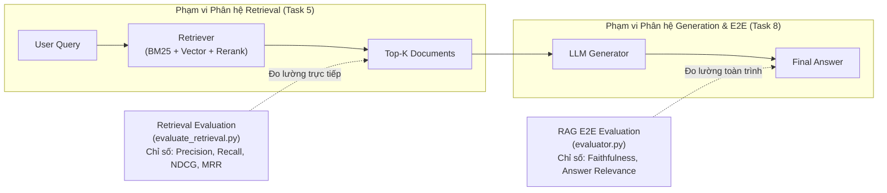
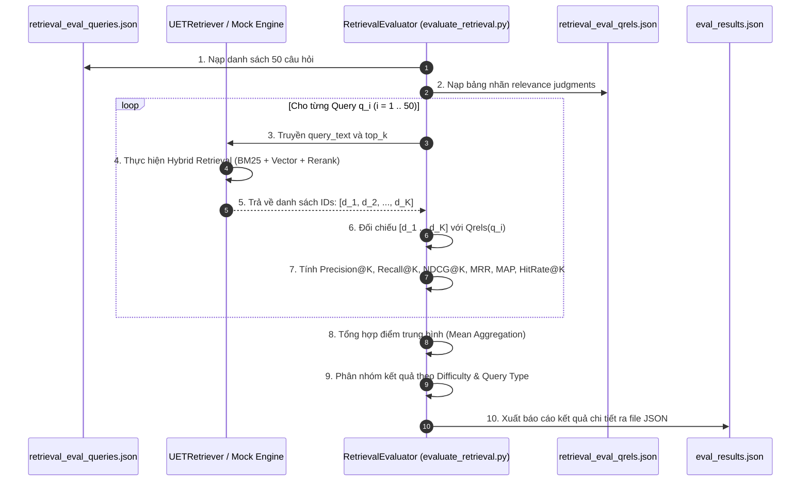

# Tài Liệu Kỹ Thuật: Quy Trình Đánh Giá Phân Hệ Retrieval (Retrieval Evaluation)

Tài liệu này cung cấp đặc tả kỹ thuật toàn diện về quy trình đo lường, kiểm thử và đánh giá hiệu năng của phân hệ **Retrieval** (Task 5) trong hệ thống UET Chatbot.

---

## 1. Mục Tiêu và Phạm Vi Đánh Giá

Trong kiến trúc RAG (Retrieval-Augmented Generation), hệ thống bao gồm hai giai đoạn độc lập:
1. **Retrieval (Truy xuất):** Tìm kiếm và xếp hạng các đoạn văn bản ($K$ chunks) liên quan nhất từ kho dữ liệu dựa trên câu hỏi người dùng.
2. **Generation (Sinh phản hồi):** Mô hình ngôn ngữ lớn (LLM) đọc ngữ cảnh được trích xuất để tạo câu trả lời hoàn chỉnh.



### Phân định trách nhiệm:
- **Đánh giá End-to-End RAG (`src/evaluation/evaluator.py` - Task 8):** Đánh giá chất lượng của toàn bộ hệ thống sau khi sinh câu trả lời, sử dụng các chỉ số ngôn ngữ ngữ nghĩa (Faithfulness, Groundedness, Answer Relevance).
- **Đánh giá Retrieval (`src/evaluation/evaluate_retrieval.py` - Task 5):** Đánh giá độc lập chất lượng của thuật toán trích xuất và xếp hạng tài liệu. Việc đánh giá này được thực hiện trên không gian ID tài liệu thông qua các chỉ số Information Retrieval (IR) chuẩn hóa, không phụ thuộc vào LLM và không phát sinh chi phí gọi API sinh văn bản.

---

## 2. Cấu Trúc Bộ Dữ Liệu Benchmark

Bộ dữ liệu đánh giá tại thư mục `data/eval_data/retrieval_eval_data/` tuân thủ cấu trúc chuẩn của các bộ benchmark tìm kiếm thông tin quốc tế (TREC, MS MARCO, BEIR):

```
data/eval_data/retrieval_eval_data/
├── retrieval_eval_corpus.jsonl    # [1] Toàn bộ kho văn bản tham chiếu (Corpus)
├── retrieval_eval_queries.json   # [2] Tập câu hỏi đánh giá kèm nhãn (Queries)
├── retrieval_eval_qrels.json     # [3] Bảng ánh xạ đáp án mức độ liên quan (Qrels)
└── dataset_metadata.json         # [4] Thông số kỹ thuật mô tả tập dữ liệu
```

### 2.1. Corpus Tham Chiếu (`retrieval_eval_corpus.jsonl`)
Bao gồm toàn bộ 3,244 văn bản đã được tiền xử lý và lập chỉ mục trong hệ thống. Mỗi dòng là một đối tượng JSON:
```json
{
  "id": "4857ad8abb33d836",
  "title": "Cử nhân Công nghệ thông tin",
  "content": "CHƯƠNG TRÌNH ĐÀO TẠO ĐẠI HỌC NGÀNH CÔNG NGHỆ THÔNG TIN...",
  "unit": "FIT",
  "category": "DAO_TAO",
  "domain": "fit.uet.vnu.edu.vn",
  "source_url_or_path": "https://fit.uet.vnu.edu.vn/cu-nhan-cntt"
}
```

### 2.2. Tập Câu Hỏi Kiểm Thử (`retrieval_eval_queries.json`)
Bao gồm 50 câu hỏi được thiết kế bao phủ các chủ đề đào tạo, tuyển sinh, quy chế và các đơn vị trực thuộc trường UET:
- **Độ khó (`difficulty`):**
  - `easy` (11 câu): Hỏi trực tiếp, từ khóa tường minh.
  - `medium` (31 câu): Yêu cầu suy luận ngữ nghĩa, chứa từ đồng nghĩa hoặc câu hỏi văn phong tự nhiên.
  - `hard` (8 câu): So sánh đa đối tượng, truy vấn đa chặng (multi-hop) hoặc tổng hợp diện rộng.
- **Kiểu câu hỏi (`query_type`):** `factoid`, `list`, `procedure`, `comparison`, `multi_hop`, `informal`, `aggregation`, `out_of_domain`.
- **Cấu trúc một mẫu truy vấn:**
```json
{
  "query_id": "ret_001",
  "query_text": "Chương trình đào tạo cử nhân ngành Công nghệ thông tin tại trường Đại học Công nghệ gồm bao nhiêu tín chỉ?",
  "difficulty": "easy",
  "query_type": "factoid",
  "expected_category": "DAO_TAO",
  "expected_unit": "FIT",
  "notes": "Hỏi về CTĐT cử nhân CNTT (Khoa FIT)",
  "num_highly_relevant": 6,
  "num_relevant": 5,
  "highly_relevant_doc_ids": ["4857ad8abb33d836", "5ec68099dd51672e", ...],
  "relevant_doc_ids": ["1971f7ffe81d1eca", "978fc5f38d7b9322", ...]
}
```

### 2.3. Bảng Ánh Xạ Độ Liên Quan - Qrels (`retrieval_eval_qrels.json`)
`qrels` (Query Relevance Judgments) là từ điển chuẩn hóa ánh xạ từ `query_id` sang danh sách `doc_id` và trọng số liên quan tương ứng:
$$\text{qrels} = \{ \text{query\_id} : \{ \text{doc\_id} : \text{relevance\_score} \} \}$$

**Thang đo liên quan (Relevance Scale):**
| Điểm số (`score`) | Định danh | Định nghĩa ngữ nghĩa |
| :---: | :--- | :--- |
| **`2`** | Highly Relevant | Văn bản trả lời trực tiếp, đầy đủ và chuẩn xác câu hỏi. |
| **`1`** | Relevant | Văn bản chứa thông tin bổ trợ, ngữ cảnh liên quan một phần. |
| **`0`** | Non-relevant | Văn bản không liên quan (ngầm định cho mọi tài liệu không có trong qrels). |

---

## 3. Quy Trình Thực Thi Đánh Giá Chi Tiết

Quy trình đánh giá được thực hiện qua các bước tuần tự sau:



### Các bước tính toán nội bộ:
1. **Lấy tập nhãn chuẩn:** Với mỗi $q_i$, lấy tập ID có liên quan $R(q_i) = \{d \mid \text{qrels}[q_i][d] \ge 1\}$.
2. **Lấy kết quả truy xuất:** Lấy danh sách tài liệu được xếp hạng $L(q_i) = [d_1, d_2, \dots, d_K]$ từ Retriever.
3. **Tính toán chỉ số đơn lẻ:** Áp dụng các công thức IR cho từng câu hỏi tại các ngưỡng $K \in \{1, 3, 5, 10, 20\}$.
4. **Loại trừ mẫu Out-of-Domain khi tính trung bình:** Các câu hỏi `out_of_domain` (không có câu trả lời trong dữ liệu trường) được phân tích riêng nhằm đo tỉ lệ chống trả về sai lệch, không tính vào điểm Recall trung bình của các câu hỏi in-domain.
5. **Tính toán trung bình tổng hợp:**
   $$\text{MeanMetric} = \frac{1}{|Q_{\text{in-domain}}|} \sum_{q \in Q_{\text{in-domain}}} \text{Metric}(q)$$

---

## 4. Cơ Sở Toán Học Của Các Chỉ Số Đánh Giá (Metrics)

Phân hệ sử dụng các công cụ đo lường Information Retrieval chuẩn hóa được cài đặt tại `src/evaluation/metrics.py`:

### 4.1. Precision@K (Độ chính xác tại ngưỡng K)
Đo tỉ lệ phần trăm các tài liệu thực sự liên quan trong số $K$ tài liệu được trả về.
$$\text{Precision@K} = \frac{|\{d_1, d_2, \dots, d_K\} \cap R(q)|}{K}$$

- **Ý nghĩa kỹ thuật:** Đánh giá mức độ "sạch" của ngữ cảnh. Precision thấp đồng nghĩa với việc prompt gửi sang LLM chứa nhiều tài liệu nhiễu, làm tăng nguy cơ sinh ảo giác (hallucination).

### 4.2. Recall@K (Độ bao phủ tại ngưỡng K)
Đo tỉ lệ phần trăm các tài liệu liên quan đã được tìm thấy trong Top-$K$ so với tổng số tài liệu liên quan hiện có trong toàn bộ cơ sở dữ liệu.
$$\text{Recall@K} = \frac{|\{d_1, d_2, \dots, d_K\} \cap R(q)|}{|R(q)|}$$

- **Ý nghĩa kỹ thuật:** Đánh giá mức độ bỏ sót thông tin. Nếu Recall thấp, LLM sẽ thiếu dữ liệu cần thiết để trả lời đầy đủ câu hỏi phức tạp.

### 4.3. Hit Rate@K (Tỉ lệ bắn trúng tại ngưỡng K)
Chỉ số nhị phân phản ánh việc có ít nhất một tài liệu liên quan xuất hiện trong Top-$K$ hay không.
$$\text{HitRate@K} = \begin{cases} 1.0 & \text{nếu } |\{d_1, d_2, \dots, d_K\} \cap R(q)| > 0 \\ 0.0 & \text{ngược lại} \end{cases}$$

- **Ý nghĩa kỹ thuật:** Trong nhiều bài toán Factoid QA, chỉ cần trích xuất được tối thiểu một tài liệu cốt lõi là hệ sinh câu trả lời đã có thể hoạt động chính xác.

### 4.4. MRR (Mean Reciprocal Rank - Thứ hạng nghịch đảo trung bình)
Nghịch đảo vị trí của tài liệu liên quan đầu tiên tìm thấy trong danh sách kết quả.
$$\text{RR}(q) = \begin{cases} \frac{1}{\min \{i \mid d_i \in R(q)\}} & \text{nếu tìm thấy tài liệu liên quan} \\ 0.0 & \text{ngược lại} \end{cases}$$
$$\text{MRR} = \frac{1}{|Q|} \sum_{q \in Q} \text{RR}(q)$$

- **Ý nghĩa kỹ thuật:** Đo lường khả năng đưa thông tin liên quan lên vị trí ưu tiên cao nhất ($i = 1$). Nếu tài liệu đúng nằm ở vị trí số 1, điểm là $1.0$; nếu nằm ở vị trí số 2, điểm giảm còn $0.5$.

### 4.5. Average Precision & MAP (Mean Average Precision)
Tính toán trung bình độ chính xác tại từng vị trí xuất hiện tài liệu liên quan:
$$\text{AP}(q) = \frac{1}{|R(q)|} \sum_{k=1}^{K} \text{Precision@k} \cdot \mathbb{I}(d_k \in R(q))$$
Trong đó $\mathbb{I}(\cdot)$ là hàm chỉ thị nhận giá trị $1$ nếu $d_k \in R(q)$ và $0$ nếu ngược lại.
$$\text{MAP} = \frac{1}{|Q|} \sum_{q \in Q} \text{AP}(q)$$

### 4.6. NDCG@K (Normalized Discounted Cumulative Gain tại ngưỡng K)
Chỉ số phản ánh chất lượng xếp hạng có tính đến mức độ liên quan đa cấp ($rel \in \{0, 1, 2\}$). Thuật toán áp dụng hàm suy giảm theo logarit nhằm phạt các tài liệu quan trọng bị xếp ở thứ hạng thấp:

1. **Discounted Cumulative Gain (DCG):**
   $$\text{DCG@K} = \sum_{i=1}^{K} \frac{2^{rel(d_i)} - 1}{\log_2(i + 1)}$$

2. **Ideal Discounted Cumulative Gain (IDCG):**
   Là giá trị DCG tối đa lý thuyết đạt được khi sắp xếp tất cả các tài liệu theo mức độ liên quan giảm dần:
   $$\text{IDCG@K} = \sum_{i=1}^{\min(K, |R(q)|)} \frac{2^{rel_{\text{ideal}}(i)} - 1}{\log_2(i + 1)}$$

3. **Normalized DCG:**
   $$\text{NDCG@K} = \begin{cases} \frac{\text{DCG@K}}{\text{IDCG@K}} & \text{nếu } \text{IDCG@K} > 0 \\ 0.0 & \text{ngược lại} \end{cases}$$

- **Ý nghĩa kỹ thuật:** Đây là tiêu chuẩn vàng để đánh giá module Reranker. Tài liệu mức 2 nếu đứng ở vị trí 1 sẽ đem lại điểm số tối đa ($1.0$). Nếu bị tụt xuống vị trí 5, mẫu số $\log_2(6)$ sẽ làm giảm mạnh giá trị đóng góp của tài liệu đó vào tổng điểm.

---

## 5. Ví Dụ Tính Toán Cụ Thể

Giả sử câu hỏi $q$ có tập nhãn chuẩn gồm 3 tài liệu:
- $d_A$ (Mức 2)
- $d_B$ (Mức 2)
- $d_C$ (Mức 1)
Tổng số tài liệu liên quan: $|R(q)| = 3$.

Retriever trả về danh sách Top 5 ($K = 5$):
$$\text{Danh sách trả về} = [d_A, d_X, d_C, d_Y, d_B]$$
(Trong đó $d_X, d_Y$ là các tài liệu không liên quan, mức 0).

### Bảng phân tích theo từng vị trí (Rank):
| Thứ hạng $i$ | Doc ID | Mức liên quan $rel$ | Nhận diện | Precision@i | Discount $\log_2(i+1)$ | Gain $2^{rel} - 1$ |
| :---: | :---: | :---: | :---: | :---: | :---: | :---: |
| **1** | $d_A$ | 2 | Đúng (Mức 2) | $1/1 = 1.000$ | $\log_2(2) = 1.000$ | $2^2 - 1 = 3$ |
| **2** | $d_X$ | 0 | Sai | $1/2 = 0.500$ | $\log_2(3) = 1.585$ | $2^0 - 1 = 0$ |
| **3** | $d_C$ | 1 | Đúng (Mức 1) | $2/3 = 0.667$ | $\log_2(4) = 2.000$ | $2^1 - 1 = 1$ |
| **4** | $d_Y$ | 0 | Sai | $2/4 = 0.500$ | $\log_2(5) = 2.322$ | $2^0 - 1 = 0$ |
| **5** | $d_B$ | 2 | Đúng (Mức 2) | $3/5 = 0.600$ | $\log_2(6) = 2.585$ | $2^2 - 1 = 3$ |

### Kết quả tính toán cho mẫu truy vấn:
1. **Precision@5:** $\frac{3}{5} = 0.6000$
2. **Recall@5:** $\frac{3}{3} = 1.0000$ (Đã tìm thấy toàn bộ 3 tài liệu)
3. **Hit Rate@5:** $1.0000$ (Có ít nhất 1 tài liệu đúng trong Top 5)
4. **MRR:** Tài liệu đúng đầu tiên ($d_A$) nằm ở vị trí 1 $\to \text{RR} = \frac{1}{1} = 1.0000$
5. **DCG@5:**
   $$\text{DCG@5} = \frac{3}{1.0} + \frac{0}{1.585} + \frac{1}{2.0} + \frac{0}{2.322} + \frac{3}{2.585} = 3.0 + 0.5 + 1.1605 = 4.6605$$
6. **IDCG@5 (Xếp hạng lý tưởng $[2, 2, 1, 0, 0]$):**
   $$\text{IDCG@5} = \frac{3}{1.0} + \frac{3}{1.585} + \frac{1}{2.0} = 3.0 + 1.8927 + 0.5 = 5.3927$$
7. **NDCG@5:**
   $$\text{NDCG@5} = \frac{4.6605}{5.3927} = 0.8642$$

---

## 6. Hướng Dẫn Sử Dụng và Giao Diện Lập Trình (API)

### 6.1. Thực thi qua Giao diện Dòng lệnh (CLI)

Chạy từ thư mục gốc của dự án (`UET_chatbot`):

#### Chế độ Giả lập (Mock Mode)
Sử dụng ground-truth để xác thực quy trình tính toán chỉ số và kiểm tra tính toàn vẹn của pipeline đánh giá:
```powershell
python src/evaluation/evaluate_retrieval.py --mode mock --top_k 5
```

#### Chế độ Thực tế (Live Mode)
Kết nối trực tiếp vào `UETRetriever` (BM25 + ChromaDB + RRF + Reranker) để đánh giá hệ thống thực nghiệm:
```powershell
python src/evaluation/evaluate_retrieval.py --mode live --top_k 5
```

#### Tham số dòng lệnh mở rộng:
- `--top_k`: Ngưỡng số lượng tài liệu trích xuất cần đo lường (mặc định: `5`).
- `--eval_dir`: Đường dẫn tùy chỉnh tới thư mục dữ liệu benchmark.
- `--output`: Đường dẫn lưu file kết quả JSON chi tiết.

---

### 6.2. Tích hợp trực tiếp trong Mã nguồn Python

Lớp `RetrievalEvaluator` được thiết kế dạng module hóa cao:

```python
from src.evaluation import RetrievalEvaluator

# 1. Khởi tạo Evaluator (Tự động nạp queries và qrels từ data/eval_data/retrieval_eval_data/)
evaluator = RetrievalEvaluator()

# 2. Phương thức A: Đánh giá trực tiếp một đối tượng Retriever instance
# (Retriever phải cài đặt phương thức retrieve(user_query, top_k=5))
report = evaluator.evaluate_retriever(retriever, top_k=5)

# 3. Phương thức B: Đánh giá một tập kết quả ID đã có sẵn
mock_predictions = {
    "ret_001": ["4857ad8abb33d836", "5ec68099dd51672e", "957bfc903f7d2062"],
    "ret_002": ["34702b80fc0fe55b", "d566fff88515dc79"],
}
report = evaluator.evaluate_batch(mock_predictions, k_values=[1, 3, 5, 10, 20])

# 4. Trích xuất chỉ số tổng hợp
agg = report["aggregated_metrics"]
print(f"NDCG@5:     {agg['mean_ndcg@5']:.4f}")
print(f"Recall@5:   {agg['mean_recall@5']:.4f}")
print(f"Precision@5:{agg['mean_precision@5']:.4f}")
print(f"MRR:        {agg['mean_mrr']:.4f}")
```

---

## 7. Cấu Trúc Báo Cáo Kết Quả Đầu Ra (`eval_results.json`)

Khi thực thi, file kết quả chứa cấu trúc phân cấp cho phép phân tích sâu:

```json
{
  "summary": {
    "total_queries": 50,
    "evaluated_queries": 50,
    "in_domain_queries": 47
  },
  "aggregated_metrics": {
    "mean_precision@1": 0.9787,
    "mean_recall@1": 0.1639,
    "mean_ndcg@1": 0.9787,
    "mean_hit_rate@1": 0.9787,
    "mean_precision@5": 0.9319,
    "mean_recall@5": 0.6067,
    "mean_ndcg@5": 1.0476,
    "mean_hit_rate@5": 0.9787,
    "mean_mrr": 1.0000,
    "mean_map": 0.6067
  },
  "by_difficulty": {
    "easy": { "mean_precision@5": 0.8500, "mean_recall@5": 0.6718, "mean_ndcg@5": 1.0480 },
    "medium": { "mean_precision@5": 0.9680, "mean_recall@5": 0.5888, "mean_ndcg@5": 1.0468 },
    "hard": { "mean_precision@5": 1.0000, "mean_recall@5": 0.5076, "mean_ndcg@5": 1.0499 }
  },
  "by_query_type": {
    "factoid": { "mean_precision@5": 0.9250, "mean_ndcg@5": 1.0485, "mean_mrr": 1.0000 },
    "list": { "mean_precision@5": 0.9417, "mean_ndcg@5": 1.0450, "mean_mrr": 1.0000 },
    "procedure": { "mean_precision@5": 0.8800, "mean_ndcg@5": 1.0420, "mean_mrr": 1.0000 }
  },
  "per_query_results": [
    {
      "query_id": "ret_001",
      "query_text": "Chương trình đào tạo cử nhân ngành Công nghệ thông tin...",
      "difficulty": "easy",
      "query_type": "factoid",
      "num_retrieved": 5,
      "num_relevant_in_ground_truth": 11,
      "precision@5": 1.0,
      "recall@5": 0.4545,
      "ndcg@5": 1.0,
      "mrr": 1.0,
      "hit_rate@5": 1.0
    }
  ]
}
```

---

## 8. Ứng Dụng Trong Tối Ưu Hóa Kỹ Thuật (A/B Testing & Error Analysis)

Bộ công cụ đánh giá này là cơ sở thực nghiệm định lượng cho các quyết định cải tiến kỹ thuật trong phân hệ Retrieval:

1. **So sánh mô hình nhúng (Embedding Model Benchmarking):**
   Chạy song song việc đánh giá với các mô hình embedding khác nhau (ví dụ: `text-embedding-004`, `bge-m3`, `vietnamese-bi-encoder`) để xác định mô hình có điểm `Recall@10` và `MRR` cao nhất trên dữ liệu quy chế tiếng Việt.
2. **Hiệu chỉnh trọng số Fusion (RRF Weight Tuning):**
   Thử nghiệm biến thiên tỉ lệ trọng số giữa nhánh BM25 và nhánh Vector ($w_{\text{bm25}} : w_{\text{vec}}$) từ $0.2:0.8$ đến $0.5:0.5$ để tìm điểm cực đại của chỉ số `NDCG@5`.
3. **Đánh giá giá trị gia tăng của Reranker (Ablation Study):**
   Đo lường mức độ cải thiện của `NDCG@5` khi có và không có giai đoạn Reranking nhằm định lượng sự đánh đổi giữa thời gian phản hồi (latency) và độ chính xác xếp hạng.
4. **Phân tích lỗi (Error Analysis):**
   Dựa trên trường `per_query_results`, trích xuất các truy vấn có `HitRate@5 = 0` hoặc `MRR < 0.5` để điều tra nguyên nhân (do phân đoạn chunk quá ngắn, do từ khóa chuyên ngành chưa được bổ sung vào từ điển BM25, hay do độ tương đồng vector thấp).
